<div align="center">

<picture>
  <source media="(prefers-color-scheme: dark)" srcset="./hero-banner.svg" />
  <source media="(prefers-color-scheme: light)" srcset="./hero-banner.svg" />
  
</picture>

<br/>

<a href="https://git.io/typing-svg">
  
</a>

<br/>

<p align="center">
  <a href="https://www.poseic.xyz">
    
  </a>
  &nbsp;
  <a href="https://discord.gg/sql">
    
  </a>
  &nbsp;
  <a href="https://github.com/poseicc">
    
  </a>
  &nbsp;
  
</p>

<br/>


</div>

### `01 // WHO IS POSEIC?`

```
┌── SYSTEM METRICS ────────────────────────────────────────────────────────┐
│  HANDLE     : poseicc                STATUS  : ACTIVE                    │
│  ROLE       : System Builder & Dev   ORIGIN  : Turkey                    │
│  FOCUS      : Discord • Python • Systems • Infrastructure • Web          │
│  PHILOSOPHY : "Code until ideas turn into self-sustaining systems."      │
└──────────────────────────────────────────────────────────────────────────┘
```

I am **Poseic** — a 16-year-old software developer and builder focused on architecting resilient Discord bot infrastructures, Python automation frameworks, Minecraft server systems, and clean web interfaces.

Rather than building disposable prototypes, I focus on systems that run continuously:
- **Resilience over complexity**: Writing code that handles edge-cases, network dips, and API rate limits cleanly.
- **Low-level curiosity**: Diving into Linux daemons, SSH hardening, and memory profiling instead of relying blindly on abstracted SaaS.
- **End-to-end execution**: Taking an idea from initial design and logic flow through to production deployment and community usage.

<br/>

<div align="center">
  
</div>

### `02 // CORE DOMAINS`

<table>
  <tr>
    <td width="50%" valign="top">
      <h4>🤖 Discord Systems & Bot Architecture</h4>
      <p>Building high-concurrency bot infrastructures with Discord.js v14.</p>
      <ul>
        <li><b>Interactions:</b> Slash command dispatchers, autocomplete handlers, dynamic modals, and button components.</li>
        <li><b>Safety & Moderation:</b> Real-time anti-spam filters, intelligent word gating, automated sanction chains, and audit logs.</li>
        <li><b>Lifecycle & State:</b> Persistent role hierarchies, member verification flows, and event-driven state sync.</li>
      </ul>
      <p><code>Node.js</code> • <code>Discord.js v14</code> • <code>Event Bus</code> • <code>State Sync</code></p>
    </td>
    <td width="50%" valign="top">
      <h4>🐍 Python & System Automation</h4>
      <p>Tooling, process automations, and graphics experiments.</p>
      <ul>
        <li><b>Automation:</b> Background daemon scripts, file system monitors, webhook dispatchers, and automated scrapers.</li>
        <li><b>3D Voxel Engine:</b> Interactive block-world prototype built on Ursina Engine featuring voxel placement, raycasting, and physics.</li>
        <li><b>APIs & Wrappers:</b> Fast asynchronous endpoints and utility pipelines.</li>
      </ul>
      <p><code>Python 3</code> • <code>Ursina Engine</code> • <code>AsyncIO</code> • <code>APIs</code></p>
    </td>
  </tr>
  <tr>
    <td width="50%" valign="top">
      <h4>🖥️ Linux Infrastructure & Servers</h4>
      <p>Managing remote virtual dedicated servers (VDS) for persistent workloads.</p>
      <ul>
        <li><b>Environment:</b> Debian / Ubuntu server setup, SSH key security, UFW firewall configuration, and unprivileged user management.</li>
        <li><b>Reliability:</b> systemd service daemons, auto-restart triggers, log rotation, and swap memory optimization.</li>
        <li><b>Minecraft Infra:</b> PaperMC / Purpur JVM flag tuning (Aikar's flags), chunk cache optimization, and network latency reduction.</li>
      </ul>
      <p><code>Linux</code> • <code>Bash</code> • <code>systemd</code> • <code>PaperMC</code> • <code>SSH</code></p>
    </td>
    <td width="50%" valign="top">
      <h4>🌐 Web Engineering & Interfaces</h4>
      <p>Crafting high-speed, modern web experiences with zero unnecessary weight.</p>
      <ul>
        <li><b>Vanilla Precision:</b> Semantic HTML5, modern modular CSS (variables, grid, flexbox), and reactive vanilla JavaScript.</li>
        <li><b>Personal Hub:</b> <a href="https://www.poseic.xyz">poseic.xyz</a> — Responsive, dark-mode native portfolio and gateway.</li>
        <li><b>UI Systems:</b> Developer dashboards, clean typography, and accessible navigation.</li>
      </ul>
      <p><code>HTML5</code> • <code>CSS3</code> • <code>JavaScript (ESNext)</code> • <code>Responsive</code></p>
    </td>
  </tr>
</table>

<br/>

<div align="center">
  
</div>

### `03 // TECH STACK`

<div align="center">

<table border="0">
  <tr>
    <td align="right"><b>Languages</b></td>
    <td>
      <a href="#"></a>
    </td>
  </tr>
  <tr>
    <td align="right"><b>Runtimes & Frameworks</b></td>
    <td>
      <a href="#"></a>
    </td>
  </tr>
  <tr>
    <td align="right"><b>Systems & Operations</b></td>
    <td>
      <a href="#"></a>
    </td>
  </tr>
  <tr>
    <td align="right"><b>Environment & Storage</b></td>
    <td>
      <a href="#"></a>
    </td>
  </tr>
</table>

</div>

<br/>

<div align="center">
  
</div>

### `04 // FEATURED WORK & ENGINEERING HIGHLIGHTS`

<table>
  <tr>
    <td width="50%" valign="top">
      <h3>🤖 Marpel Discord Architecture</h3>
      <p><b>Production Bot Engine</b></p>
      <p>Custom-built Discord bot with comprehensive server management features:</p>
      <ul>
        <li>Discord.js v14 slash commands with button & modal confirmations.</li>
        <li>Automated sanction logging and granular role management workflows.</li>
        <li>High-uptime runtime designed for community servers.</li>
      </ul>
      <p>
        
        
      </p>
    </td>
    <td width="50%" valign="top">
      <h3>🐍 Ursina 3D Voxel Sandbox</h3>
      <p><b>Interactive Python Prototype</b></p>
      <p>A voxel engine proof-of-concept exploring game physics and procedural generation in pure Python:</p>
      <ul>
        <li>Real-time block placement, destruction, and raycast collision detection.</li>
        <li>Custom texture coordinates and first-person controller mechanics.</li>
        <li>Lightweight geometry batching for stable frame rates.</li>
      </ul>
      <p>
        
        
      </p>
    </td>
  </tr>
  <tr>
    <td width="50%" valign="top">
      <h3>🌐 poseic.xyz Platform</h3>
      <p><b>Personal Web Hub</b></p>
      <p>Fast, lightweight personal landing page and project showcase:</p>
      <ul>
        <li>Zero framework bloat — 100% vanilla web performance.</li>
        <li>Dark-first responsive design tailored for mobile and desktop screens.</li>
        <li>Structured metadata, social previews, and instant load time.</li>
      </ul>
      <p>
        
        <a href="https://www.poseic.xyz"></a>
      </p>
    </td>
    <td width="50%" valign="top">
      <h3>🎮 Minecraft Dedicated Server Infrastructure</h3>
      <p><b>VDS Optimization & Deployment</b></p>
      <p>High-performance game server architecture hosted on a remote Linux VDS:</p>
      <ul>
        <li>Aikar's optimized G1GC JVM parameters for consistent 20.0 TPS.</li>
        <li>Automated crash recovery and service monitoring via systemd.</li>
        <li>Firewall isolation, anti-DDoS proxy configuration, and SSH key policies.</li>
      </ul>
      <p>
        
        
      </p>
    </td>
  </tr>
</table>

<br/>

<div align="center">
  
</div>

### `05 // GITHUB TELEMETRY`

<div align="center">

<p align="center">
  
  &nbsp;
  
</p>

<p align="center">
  
</p>

<br/>

<p align="center">
  
</p>

</div>

<br/>

<div align="center">
  
</div>

### `06 // THE ENGINE CYCLE`

<div align="center">

```
  ┌───────────┐       ┌───────────┐       ┌───────────┐
  │   LEARN   │ ───>  │   BUILD   │ ───>  │   BREAK   │
  └───────────┘       └───────────┘       └───────────┘
        ▲                                       │
        │                                       ▼
  ┌───────────┐       ┌───────────┐       ┌───────────┐
  │  REPEAT   │  <─── │   SHIP    │  <─── │ UNDERSTAND│
  └───────────┘       └───────────┘       └───────────┘
```

</div>

> *"Software isn't finished when there is nothing more to add, but when edge cases have been conquered and the system runs unattended without complaint."*

<br/>

<div align="center">
  
</div>

### `07 // BEYOND CODE & COMMUNITY`

<table>
  <tr>
    <td width="50%" valign="top">
      <h4>📺 Content & Knowledge Sharing</h4>
      <p>Breaking down complex tech and sharing developer journeys:</p>
      <ul>
        <li><b>YouTube Shorts:</b> Rapid-fire technical showcases, automation tips, and development logs.</li>
        <li><b>Dev Communities:</b> Helping fellow young builders navigate Discord.js transitions, Linux commands, and bot architecture.</li>
        <li><b>Open Discussions:</b> Demystifying server management and modern web stacks.</li>
      </ul>
    </td>
    <td width="50%" valign="top">
      <h4>💬 The Community Hub</h4>
      <p>Building together in our dedicated developer Discord:</p>
      <ul>
        <li><b>Collaboration:</b> Real-time feedback, bot testing, and tech brainstorming.</li>
        <li><b>Discussions:</b> From Discord API changes to server optimization tricks.</li>
        <li><b>Direct Access:</b> Say hi and connect directly with me.</li>
      </ul>
      <p align="center">
        <a href="https://discord.gg/sql">
          
        </a>
      </p>
    </td>
  </tr>
</table>

<br/>

<div align="center">
  
</div>

<div align="center">

### `08 // INITIATE DIALOGUE`

Whether you want to discuss Discord bot architectures, Linux server tuning, Python scripts, or collaborate on a project — my channels are open.

<br/>

<p align="center">
  <a href="https://www.poseic.xyz">
    
  </a>
  &nbsp;&nbsp;
  <a href="https://discord.gg/sql">
    
  </a>
  &nbsp;&nbsp;
  <a href="https://github.com/poseicc">
    
  </a>
</p>

<br/>


<p align="center">
  <sub>Designed with precision for <b>Poseic</b> • 2026 • Istanbul</sub>
</p>

</div>
