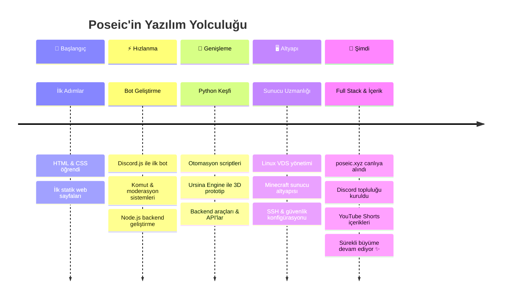

<div align="center">

<!-- ╔══════════════════════════════════════════════════════════╗ -->
<!--              ANIMATED HEADER BANNER                        -->
<!-- ╚══════════════════════════════════════════════════════════╝ -->


<!-- ╔══════════════════════════════════════════════════════════╗ -->
<!--                   TYPING EFFECT                            -->
<!-- ╚══════════════════════════════════════════════════════════╝ -->

<a href="https://git.io/typing-svg">
  
</a>

<br/>

<!-- PROFILE BADGES -->

<p align="center">
  <a href="https://www.poseic.xyz">
    
  </a>
  &nbsp;
  <a href="https://discord.gg/sql">
    
  </a>
  &nbsp;
  
  &nbsp;
  
</p>

<br/>

---

<!-- ╔══════════════════════════════════════════════════════════╗ -->
<!--                    WHOAMI TERMINAL                         -->
<!-- ╚══════════════════════════════════════════════════════════╝ -->

```
╔═══════════════════════════════════════════════════════════════════════╗
║                                                                       ║
║   $ whoami                                                            ║
║                                                                       ║
║   > Merhaba! Ben Poseic — 16 yaşında bir yazılım geliştiricisi.      ║
║   > Discord botları, Python otomasyonları, Minecraft altyapıları      ║
║   > ve web projeleri üzerine tutkuyla çalışıyorum.                    ║
║                                                                       ║
║   $ cat interests.txt                                                 ║
║                                                                       ║
║   > 🤖  Bot geliştirme & sistem otomasyonu                            ║
║   > 🎮  Oyun sunucu altyapıları                                        ║
║   > 🐍  Python ile uçtan uca çözümler                                 ║
║   > 🌐  Web teknolojileri & backend sistemler                          ║
║   > 📺  İçerik üretimi & geliştirici topluluğu                        ║
║                                                                       ║
║   $ uptime                                                            ║
║   > Sürekli öğreniyor, sürekli üretiyor...  ✓ RUNNING                 ║
║                                                                       ║
╚═══════════════════════════════════════════════════════════════════════╝
```

<br/>

---

<!-- ╔══════════════════════════════════════════════════════════╗ -->
<!--                     TECH STACK                             -->
<!-- ╚══════════════════════════════════════════════════════════╝ -->

## ⚡ Tech Stack & Araçlar

<br/>

**🖥️ Diller & Runtime**

<p align="center">
  
</p>

**📦 Framework & Kütüphaneler**

<p align="center">
  
</p>

**🛠️ Araçlar & Platformlar**

<p align="center">
  
</p>

**🗄️ Veritabanı & Altyapı**

<p align="center">
  
</p>

<br/>

<details>
<summary><b>🔬 Detaylı Yetenek Haritası — tıkla açmak için ▼</b></summary>
<br/>

| Teknoloji | Seviye | Uzmanlık Alanı |
|-----------|--------|----------------|
| `JavaScript / Node.js` | ████████████████████ 95% | Discord botları, API'lar |
| `Python` | ██████████████████░░ 88% | Otomasyon, 3D prototipler |
| `Linux / Bash` | █████████████████░░░ 85% | VDS yönetimi, SSH, systemd |
| `Discord.js` | ████████████████████ 96% | Moderasyon, log, rol sistemi |
| `HTML / CSS` | ████████████████░░░░ 80% | Statik siteler, UI bileşenleri |
| `Git / GitHub` | ██████████████████░░ 90% | Versiyon kontrolü, CI/CD |
| `Minecraft (Paper/Spigot)` | █████████████████░░░ 85% | Plugin & altyapı |
| `Docker` | ████████████░░░░░░░░ 60% | Containerization |
| `SQL / Veritabanı` | ██████████████░░░░░░ 70% | Veri yönetimi |

</details>

<br/>

---

<!-- ╔══════════════════════════════════════════════════════════╗ -->
<!--                  FEATURED PROJECTS                         -->
<!-- ╚══════════════════════════════════════════════════════════╝ -->

## 🚀 Öne Çıkan Projeler

<br/>

<table align="center">
  <tr>
    <td width="50%">
      <h3 align="center">🤖 Discord Moderasyon Botu</h3>
      <p align="center">
        
        
        
      </p>
      <p align="center">Gelişmiş moderasyon, otomatik loglama, rol/varlık yönetimi ve özelleştirilebilir komutlarla tam kapsamlı Discord bot sistemi.</p>
      <p align="center"><code>Slash Commands</code> • <code>Auto-Mod</code> • <code>Log Sistemi</code></p>
    </td>
    <td width="50%">
      <h3 align="center">🐍 Python 3D Blok Prototipi</h3>
      <p align="center">
        
        
      </p>
      <p align="center">Ursina Engine ile geliştirilen voxel tabanlı 3D blok dünyası prototipi. Minecraft benzeri mekanikler Python ile hayata geçirildi.</p>
      <p align="center"><code>3D Rendering</code> • <code>Voxel Engine</code> • <code>Physics</code></p>
    </td>
  </tr>
  <tr>
    <td width="50%">
      <h3 align="center">🌐 poseic.xyz — Kişisel Site</h3>
      <p align="center">
        
        
        
      </p>
      <p align="center">Projelerimi, yeteneklerimi ve içeriklerimi sergileyen kişisel portföy ve web sitesi.</p>
      <p align="center"><code>Portfolio</code> • <code>Responsive</code> • <code>Dark Mode</code></p>
    </td>
    <td width="50%">
      <h3 align="center">🎮 Minecraft Sunucu Altyapısı</h3>
      <p align="center">
        
        
        
      </p>
      <p align="center">VDS üzerinde yüksek erişilebilirlik, güvenlik ve optimizasyon odaklı Minecraft sunucu altyapısı.</p>
      <p align="center"><code>VDS Yönetimi</code> • <code>SSH Güvenlik</code> • <code>Firewall</code></p>
    </td>
  </tr>
</table>

<br/>

---

<!-- ╔══════════════════════════════════════════════════════════╗ -->
<!--                   GITHUB STATS                             -->
<!-- ╚══════════════════════════════════════════════════════════╝ -->

## 📊 GitHub İstatistikleri

<br/>

<p align="center">
  
  &nbsp;&nbsp;
  
</p>

<p align="center">
  
</p>

<br/>

<p align="center">
  
</p>

<br/>

<p align="center">
  
</p>

<br/>

---

<!-- ╔══════════════════════════════════════════════════════════╗ -->
<!--              SNAKE CONTRIBUTION ANIMATION                  -->
<!-- ╚══════════════════════════════════════════════════════════╝ -->

## 🐍 Katkı Yılanı

<br/>

<p align="center">
  <picture>
    <source media="(prefers-color-scheme: dark)" srcset="https://raw.githubusercontent.com/poseicc/poseicc/output/github-contribution-grid-snake-dark.svg" />
    <source media="(prefers-color-scheme: light)" srcset="https://raw.githubusercontent.com/poseicc/poseicc/output/github-contribution-grid-snake.svg" />
    
  </picture>
</p>

> ⚙️ Snake animasyonu için GitHub Actions gereklidir. `.github/workflows/snake.yml` dosyasını oluşturup `output` branch'ı yayınla.

<br/>

---

<!-- ╔══════════════════════════════════════════════════════════╗ -->
<!--                  JOURNEY TIMELINE                          -->
<!-- ╚══════════════════════════════════════════════════════════╝ -->

## 🗺️ Yolculuğum

<br/>



<br/>

---

<!-- ╔══════════════════════════════════════════════════════════╗ -->
<!--                    FUN FACTS                               -->
<!-- ╚══════════════════════════════════════════════════════════╝ -->

## 🎲 Hakkımda İlginç Şeyler

<br/>

<table align="center">
  <tr>
    <td>⚡</td><td>16 yaşındayım ama kod tabanım yaşımdan büyük</td>
  </tr>
  <tr>
    <td>🌙</td><td>En verimli kodlama saatim: gece 23:00 – 03:00</td>
  </tr>
  <tr>
    <td>☕</td><td>Kod yazar, kahve içer, tekrar kod yazar</td>
  </tr>
  <tr>
    <td>🐛</td><td>Bug mı? Hayır, undocumented feature!</td>
  </tr>
  <tr>
    <td>🎮</td><td>Minecraft oynarken aynı anda Minecraft sunucu yönetiyorum</td>
  </tr>
  <tr>
    <td>🤖</td><td>Yazdığım botlar bazen benden akıllı davranıyor</td>
  </tr>
  <tr>
    <td>📚</td><td>Öğrenme hızı: documentation > tutorial > trial-and-error</td>
  </tr>
  <tr>
    <td>🌍</td><td>Türkiye'den dünyaya açılan bir geliştirici</td>
  </tr>
</table>

<br/>

---

<!-- ╔══════════════════════════════════════════════════════════╗ -->
<!--                 CURRENT FOCUS — JS OBJECT                  -->
<!-- ╚══════════════════════════════════════════════════════════╝ -->

## 🎯 Şu An Ne Üzerinde Çalışıyorum?

<br/>

```javascript
const poseic = {
  şuAnÖğrendiklerim: [
    "TypeScript ile tip güvenli Discord botları",
    "Docker & container orkestrasyonu",
    "REST API mimarisi & güvenlik en iyi pratikleri",
    "React ile modern frontend geliştirme",
  ],
  şuAnGeliştirdiklerim: [
    "🤖 Yeni nesil Discord moderasyon sistemi",
    "🌐 poseic.xyz v2 — tam yeniden tasarım",
    "🎮 Minecraft plugin koleksiyonu",
  ],
  hedeflerim: {
    kısa_vade:  "Full-stack web geliştirmeyi derinlemesine kavramak",
    orta_vade:  "Açık kaynak projelere aktif katkı sağlamak",
    uzun_vade:  "Kendi yazılım ürününü piyasaya sürmek 🚀",
  },
  günlükRutin: () => {
    while (alive) {
      uyandım();
      kodYazdım();
      öğrendim();
      birazOynadım(); // Minecraft :)
      daha_fazla_kodYazdım();
      yattım();       // bazen...
    }
  },
};
```

<br/>

---

<!-- ╔══════════════════════════════════════════════════════════╗ -->
<!--                   CONNECT SECTION                          -->
<!-- ╚══════════════════════════════════════════════════════════╝ -->

## 🤝 İletişim & Bağlantılar

<br/>

<p align="center">
  <a href="https://www.poseic.xyz">
    
  </a>
  &nbsp;
  <a href="https://discord.gg/sql">
    
  </a>
  &nbsp;
  <a href="https://github.com/poseicc">
    
  </a>
</p>

<br/>

---

<!-- ╔══════════════════════════════════════════════════════════╗ -->
<!--                    QUOTES                                  -->
<!-- ╚══════════════════════════════════════════════════════════╝ -->

> *"Kod yazmak demek, geleceği şimdiden inşa etmek demektir."*  
> **— Poseic, 2026**

<br/>

<p align="center">
  
</p>

<br/>

<!-- ╔══════════════════════════════════════════════════════════╗ -->
<!--                   WAVE FOOTER                              -->
<!-- ╚══════════════════════════════════════════════════════════╝ -->


</div>
